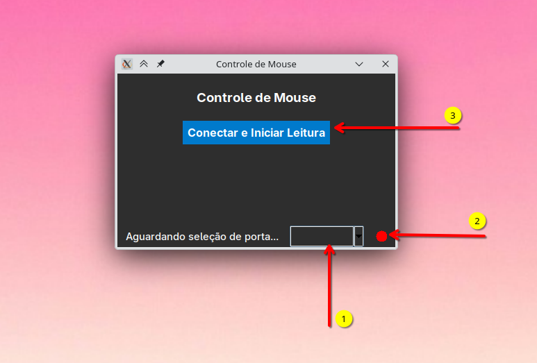

# Python mouse

Este software é um exemplo de como controlar o mouse/teclado via Python recebendo dados de uma UART.


A ideia aqui é emular um teclado/mouse via comandos recebidos de uma UART (`main.py`) que faz a leitura da porta UART e processa os dados para movimentar o mouse. Para que isso funcione corretamente, será necessário enviar os dados no seguinte formato:

```
AXIS VAL_1 VAL_0 EOP
```

Onde cada um dos termos do datagrama é composto por 8 bits que indica:

- `AXIS`: 0 ou 1 para indicar eixo `X` ou eixo `Y`.
- `VAL_0`: Byte **menos significativo** (LSB) do valor do movimento do eixo
- `VAL_1`: Byte **mais significativo** (MSB) do valor do movimento do eixo
- `EOP`: 0xFF indica fim de pacote

Exemplo:

- Movimentar o mouse no eixo X para a posição 845 (direita)

`00000000 01001101 00000011 11111111`

> Notem que o valor de 845 em binário é: `00000011 01001101`!

- Movimentar o mouse no eixo Y para a posição -55 (baixo)

`00000001 11001001 11111111 11111111`

> Notem que o valor de -55 em binário é: `11111111 11001001`!

## Instalando

Primeiro crie um ambiente virtual e instale os pacotes:

```bash
python3 -m venv venv
source venv/bin/activate
pip3 install -r requirements.txt
```

## Executando o programa

Agora é só executar o programa (`python3 main.py`) que irá abrir uma GUI onde você pode: (1) configurar a porta serial que deseja abrir, (2) verificar o status da conexão e (3) abrir a porta e conectar o programa. 



